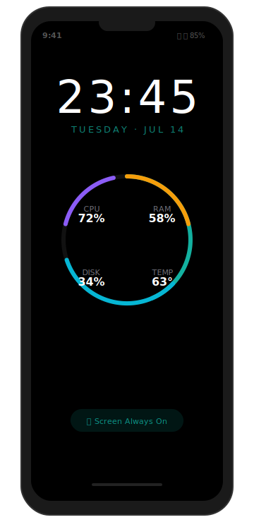
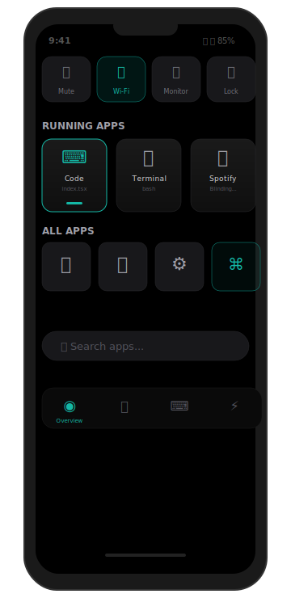

# SysDeck — Companion Dashboard & Macro Deck

Turn your spare smartphone or tablet into a beautiful, always-on secondary display for your Windows PC. Monitor system vitals, switch apps, run macros, and access deep admin tools — all without cluttering your main screen.

<p align="center">
  
  &nbsp;&nbsp;&nbsp;&nbsp;
  
</p>


---

> **⚠️ Windows SmartScreen**: When you first download the `.exe`, Windows may show "Windows protected your PC". This is a false positive — SysDeck is open-source and unsigned. Click **"More Info"** → **"Run Anyway"** to proceed. We're working on code signing.

## Features

### Always-On Overview
- **Ambient Mode** — Large clock + telemetry gauges fade to pure black on idle. OLED-friendly.
- **System Vitals** — Radial gauges for CPU, RAM, Disk, Temperature. Updated every 1s.
- **Wake Lock** — Keeps your phone screen on while the dashboard is open.
- **Quick Toggles** — One-tap: Mute, Wi-Fi, DND, Monitor Off, Lock PC, Media Play/Pause, Dark Mode.

### App & Window Deck
- **Running Apps** — Horizontal scroller of active windows with icons. Tap to bring to foreground.
- **All Apps Launcher** — Searchable drawer of all installed apps. Tap to launch.

### Deep Admin Tools
- **File Manager** — Browse, upload, download, rename, delete files. Path validation with blocked prefix checks.
- **Script Engine** — Run PowerShell/cmd scripts with live output streaming. 5-minute timeout. 1MB output cap.
- **PTY Terminal** — Full xterm.js terminal over WebSocket.
- **Power Controls** — Shutdown, restart, sleep, hibernate, sign out, lock, switch user. Scheduled power with 5s cancellation window.
- **Hardware Controls** — Volume, audio device switching, display brightness, dark mode, Wi-Fi, DND.
- **Network** — Status, Wi-Fi scan/connect, adapter toggle, DNS flush.
- **Remote Input** — Mouse (move/click/scroll/drag), keyboard (type/press/media keys), clipboard, screenshot, browser open.

### Connectivity
- **Cloudflare Quick Tunnel** — Zero-config remote access. No port forwarding, no static IP, no account required.
- **WebSocket** — Real-time telemetry, window list, clipboard sync, hardware state.
- **Auth** — Password + TOTP 2FA. Session management with refresh token rotation. Rate limiting.

## Quick Start

### Download
Grab the latest binary from [Releases](https://github.com/your-username/sysdeck/releases). Single `.exe` file, no dependencies.

### Run
```cmd
sysdeck-agent.exe
```

A browser tab opens to `http://localhost:3939`. Complete the 4-step setup wizard (password → TOTP → recovery codes → remote access).

### Add to Phone
Navigate to the IP shown in the console (or your Cloudflare URL) on your phone's browser. Use the browser's **Share → Add to Home Screen** for the full PWA experience — no URL bar, standalone window, wake lock enabled.

## Tech Stack

| Layer | Technology |
|-------|-----------|
| Backend | Rust, Axum 0.7, tokio, rusqlite (WAL), sysinfo |
| Frontend | React 19, Vite, Tailwind CSS v4, shadcn/ui |
| State | Zustand |
| Charts | Recharts |
| Icons | Lucide React |
| Terminal | xterm.js |
| Tunnel | Cloudflare Quick Tunnel (cloudflared) |
| Auth | Argon2id, TOTP, keyring (OS Keychain), zxcvbn |
| Icon Extraction | Win32 `SHGetFileInfoW` → GDI → `image` crate (PNG) |
| Window Management | `EnumWindows`, `SetForegroundWindow` |

## Architecture

```
┌─────────────────────────────────────────────┐
│  Windows PC (Host)                          │
│                                             │
│  ┌─────────────────┐     ┌──────────────┐   │
│  │  Rust Backend   │◄───►│  SQLite (WAL)│   │
│  │  (Axum)         │     └──────────────┘   │
│  ├─────────────────┤                        │
│  │  /ws            │── sysinfo + windows    │
│  │  /api/files/*   │── file manager         │
│  │  /api/icon      │── icon PNG cache       │
│  │  /api/apps      │── installed apps       │
│  │  /api/launch    │── app launcher         │
│  │  /api/windows/* │── window management    │
│  │  /api/power/*   │── power controls       │
│  │  /login + /setup│── auth + wizard        │
│  └──────┬──────────┘                        │
│         │                                   │
│  ┌──────▼───────┐     ┌────────────────┐    │
│  │  React SPA   │     │  cloudflared   │    │
│  │  (Vite PWA)  │     │  tunnel        │    │
│  │  Tailwind v4 │     └───────┬────────┘    │
│  └──────────────┘             │              │
└───────────────────────────────┼──────────────┘
                                │
                   ┌────────────▼────────────┐
                   │  Any Browser (phone,     │
                   │  tablet, another PC)     │
                   └─────────────────────────┘
```

## Development

```bash
cd backend && cargo run          # builds frontend first (via build.rs)
cd frontend && npm run dev       # Vite dev server on :5173, proxy → :3939

cd backend && cargo test          # 17 unit + 40 integration
cargo clippy                      # zero warnings
cd frontend && npm run build      # tsc -b && vite build
npm run lint                      # oxlint
```

## License

MIT
